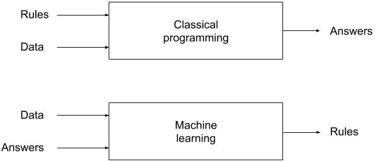
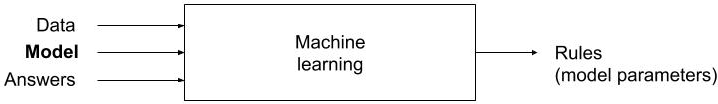

##

<br/><br/><br/>
These slides, code and all materials can be found here:
https://github.com/bwlewis/dnn_notes


## Why is this interesting?

##

DNNs have been amazingly successful in some applications...

- Superhuman Go playing
- Best known image de-noising methods
- Near-human-level image classification
- Near-human-level speech recognition
- Near-human-level handwriting transcription
- Highly accurate transaction fraud detection
- Improved machine translation
- Improved text-to-speech conversion
- Near-human-level autonomous driving
- Ability to answer natural language questions

See also Elad, "Deep, deep trouble" in SIAM News (https://sinews.siam.org/Details-Page/deep-deep-trouble-4)

##

DNNs have spawned ingenious computing advances...

<br/>

- Portable, parallelized matrix algebra libraries and systems (Tensorflow, Torch, Chainer, NVIDIA cuDNN, etc.)
- Serious use of modern computing architectures (GPU, TPU)
- Wide use of mixed-precision arithmetic
- Elegant, declarative, dataflow-based model specification (Keras)


##

And yet they are not without problems...

<br/>

- Sensitive to perturbation
- Despite simplicity of building blocks, often end up complicated and very heuristic
- Almost comically compute-intensive
- Probably being over-used for problems they are not good at (over-hyped)

<br/>

- Difficult, voluminous literature to wade through, often in a specialized and not always precise vernacular

##


##


<div style="font-size: small;">
Szegedy, et al, "Intriguing properties of neural networks" (https://arxiv.org/pdf/1312.6199.pdf)
<br/>
Ostrich image (c) Milos Andera, www.naturfoto.cz
</div>


##

<br/>


<div style="font-size: small;">
Sharif, et al. "Accessorize to a Crime: Real and Stealthy Attacks on State-of-the-Art Face Recognition" (https://www.cs.cmu.edu/~sbhagava/papers/face-rec-ccs16.pdf)
</div>

##


<div style="font-size: small;">
https://www.theatlantic.com/technology/archive/2018/01/the-shallowness-of-google-translate/551570/
</div>

##

Examples of DNNs...

<br/>

<div style="font-size: 18pt; text-align: left;">
Supervised

- <b><font style="color: blue;">Multilayer feed-forward</font></b> (we'll use this example today)
- Recurrent
- Convolutional
- LSTM recurrent
- Stochastic (RBM, other generative models)

Unsupervised

- Autoencoders (basic, sparse, variational, denoising, ...)
- LSTM
- Deep belief
- Generative adversarial networks

Reinforcement
</div>


##

"A *new* programming paradigm?"
<br/>



But this is somewhat incomplete...
<br/><br/>
<div style="font-size: small;">
from Francois Chollet and J.J. Allaire, "Deep Learning with R"
</div>

##

<br/>



Now this doesn't look that new to me!

Consider, for instance, good old ordinary least squares...


## Model Data

<br/>


Rows of **X** are p-dimensional observations of variables along the columns (aka 'features').

<br/>

<div style="font-size: small;">
- Sometimes, observations *X* are things like pictures or color pictures or movies--often referred to as 'tensors' but really simply n-d arrays.
- The measured output *y* might be a matrix instead of a vector in some cases, and defined over a field other than the reals.
</div>


## OLS

<br/>
For coefficients *W* ('weights') in **R**<sup><font style="font: italic 28px Georgia, serif;
">p</font></sup>
<br/>and scalar coefficient *b* ('bias'),
<br/>
<br/>


## A typical DNN

<br/>
For coefficients *W* and scalar coefficients *b*,
<br/>
<br/>
<br/>


##

<br/><br/>
<br/><br/>
So, maybe not so different after all?

## Generic k-layer DNN definition

<br/>


##

<br/>
The &sigma; functions are nonlinear; typically non-negative thresholding
or sigmoid functions. Minimization of objective functionals like


are non-linear and likely non-convex.

Very often solved with coordinate-wise gradient descent (aka stochastic
gradient descent).

## A 3-layer example

<br/><br/>


##


## Examples

<br/>

See the (ultra basic) example R code at http://illposed.net/deep_nnet_example.r 

##

Neural networks in practice are elegantly specified...here is an example model definition in R using Keras.
<br/>


```{r, eval=FALSE}
model <- keras_model_sequential()  %>% 
  layer_dense(units=256, activation='relu', input_shape=c(784)) %>% 
  layer_dropout(rate=0.4) %>% 
  layer_dense(units=128, activation='relu') %>%
  layer_dropout(rate=0.3) %>%
  layer_dense(units=10, activation='softmax')

model %>% compile(
  loss = 'categorical_crossentropy',
  optimizer = optimizer_rmsprop(),
  metrics = c('accuracy')
)
```

This model can be trained on any architecture (CPU, GPU, TPU, cloud, laptop...).
And, once trained, exported to any platform (server, desktop, phone, ...).


## Why coordinate-wise gradient descent?

<br/>

- Easy to implement
- Easy to work with very large data


But,

- Slow!
- And can get stuck
- And sensitive to tuning parameters


## Other nonlinear optimization approaches in use

<br/>

- SGD **batch variants**
- Accelerators like Adam (https://arxiv.org/abs/1412.6980)  (quasi-Newton like, remind me of double-dog leg, etc.)
- L-BFGS
- Conjugate gradient
- ...

## Typical regularization in use

<br/>

- l2- and/or l1-coefficient penalties at each layer
- **Drop out**
- Up-front data compression/projection


## Simple, key 'big data' insights

<br/><br/>
<table><tr>
<td>*Pattern*<td>*Use*
<tr>
<td>Lots of observations (rows)  &#8594; empirical distributions emerge for each variable.
<td>The bootstrap, and in particular the big-data bootstrap (Jordan, et al.), batched methods, matching (Rubin, King, etc.), ... Recall, for instance, batched SGD.
<tr>
<td>Lots of variables (columns) &#8594; dependencies emerge between variables.
<td>Dimensionality reduction, subspace projection, ... For instance, dropout.
</table>


## Crazy ideas?

<br/><br/>

Directly project nonlinear operator into a subspace; solve projected problem?
(Potentially computationally more efficient, plus regularization.)

<br/><br/>

Error in variables models (non-fixed)? (Total-least squares like optimization objectives.)
